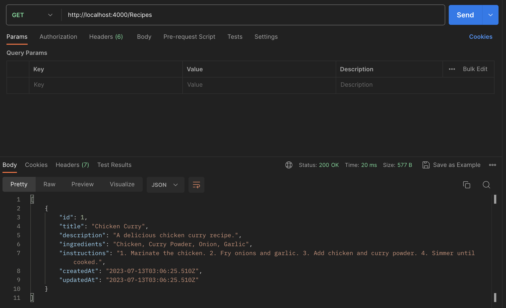
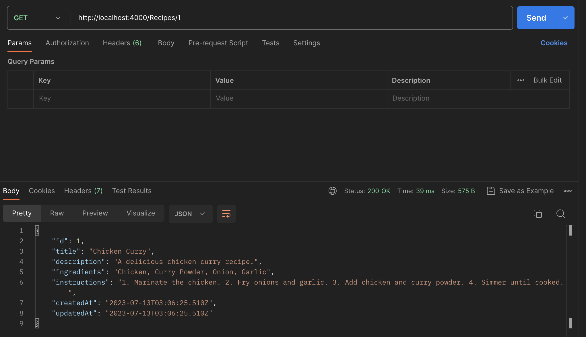
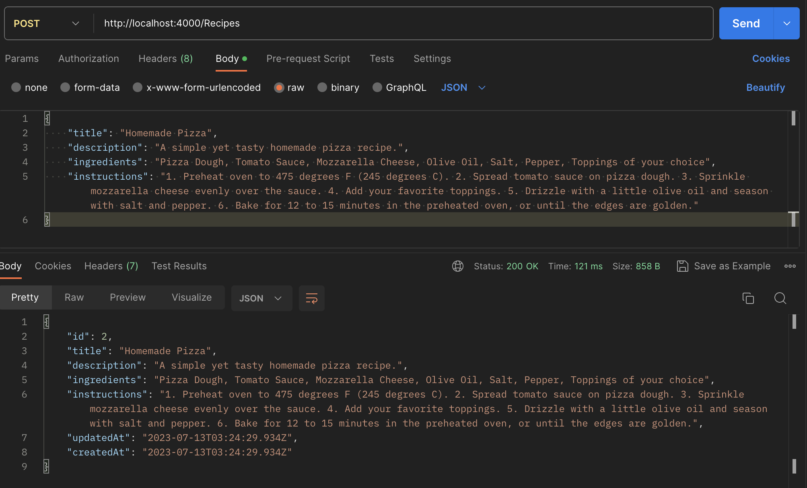
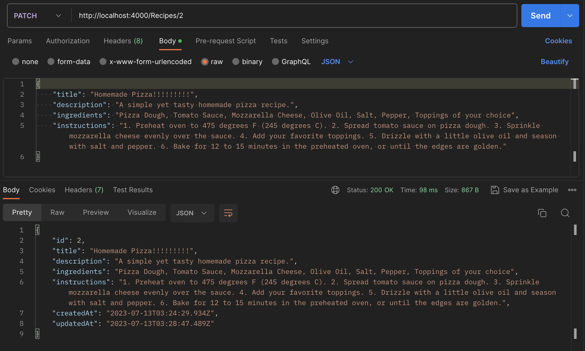
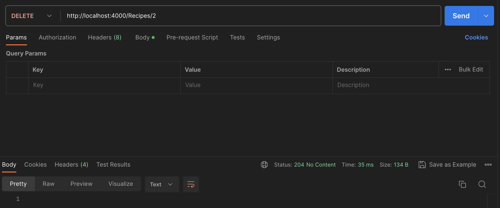

Assignment: Building a Recipe Management System with Sequelize
You will work on a project to build a recipe management system using Node.js, Express.js, and Sequelize. Your task is to implement the CRUD functionality and server-side data validation using Sequelize.
Here are the specific requirements for your assignment:
1. Set up a new Express.js application and install Sequelize as a dependency.
2. Create a Sequelize model and migration for the Recipe entity with the following properties:
id (primary key)
title (string)
description (text)
ingredients (text)
instructions (text)
createdAt (datetime)
updatedAt (datetime)
3. Generate seed data to populate the Recipe table with initial records.
4. Implement the following API endpoints using Sequelize to perform CRUD operations on recipes:
GET /recipes: Retrieve a list of all recipes.
GET /recipes/:id: Retrieve a specific recipe by ID.
POST /recipes: Create a new recipe.
PUT /recipes/:id: Update an existing recipe.
DELETE /recipes/:id: Delete a recipe.
5. Implement server-side data validation using Sequelize's built-in validation methods for the following fields:
title: Required, minimum length of 3 characters.
description: Required, maximum length of 500 characters.
ingredients: Required, maximum length of 1000 characters.
instructions: Required, maximum length of 5000 characters.
6. Handle errors and provide appropriate error messages for invalid requests or database errors.
7. Test your application using an API testing tool like Postman  to ensure that all CRUD operations and data validations are working correctly.

